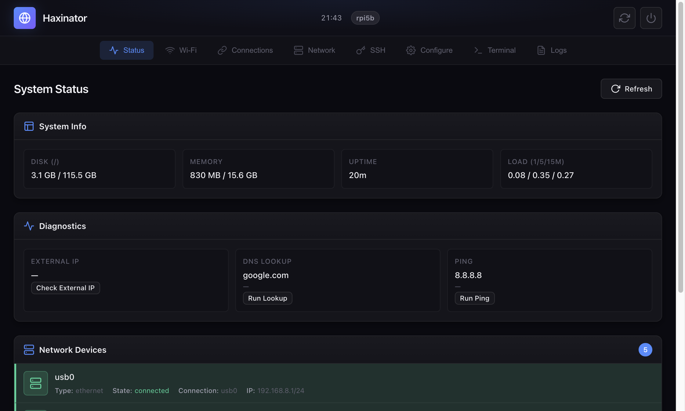

# Haxinator

A portable network tunneling platform built on Armbian. Plug it into any computer via USB, access the web UI, and connect through restrictive networks using DNS or ICMP tunnels.



## Features

- **Plug-and-Play USB** - Appears as a USB Ethernet adapter, no drivers needed
- **Web-Based Management** - Configure everything from your browser at `192.168.8.1:8080`
- **DNS Tunneling (Iodine)** - Bypass firewalls using DNS queries on port 53
- **ICMP Tunneling (HANS)** - Tunnel traffic through ping packets
- **OpenVPN Support** - Upload .ovpn configs for encrypted tunneling
- **SSH Tunnel Manager** - Create local, remote, and SOCKS tunnels
- **Wi-Fi Hotspot** - Share your tunnel connection with other devices
- **Web Terminal** - Full shell access from your browser
- **Mobile-Friendly UI** - Manage your Haxinator from any device

## Supported Hardware

| Board | Status |
|-------|--------|
| Raspberry Pi 5 | Supported |
| Raspberry Pi 4B | Supported |
| Raspberry Pi Zero 2W | Supported |
| Banana Pi M4 Zero | Supported |
| Orange Pi Zero 2W | Supported |

## Quick Start

1. **Flash** the Haxinator image to an SD card using [Raspberry Pi Imager](https://www.raspberrypi.com/software/)
2. **Connect** the Pi to your computer with a USB data cable
3. **Wait** for the USB network interface to appear (~60 seconds)
4. **Open** `http://192.168.8.1:8080` in your browser
5. **Connect** to Wi-Fi and configure your tunnels

## Default Credentials

| Service | Username | Password |
|---------|----------|----------|
| SSH | `root` | `1234` |
| Web UI | `admin` | Auto-generated (check logs) |

To view the web UI password:
```bash
ssh root@192.168.8.1
journalctl -u nm-webui | grep password
```

## Documentation

| Document | Description |
|----------|-------------|
| [Setup Guide](docs/setup.md) | Full setup instructions for Pi and tunnel server |
| [Web UI Guide](docs/webui.md) | Walkthrough of all web interface features |

## Web UI Tabs

| Tab | Function |
|-----|----------|
| **Status** | System stats, diagnostics, network devices |
| **Wi-Fi** | Scan and connect to wireless networks |
| **Connections** | Manage saved NetworkManager profiles |
| **Network** | Interface management, internet sharing |
| **SSH** | SSH key and tunnel management |
| **Configure** | Upload env-secrets and VPN configs |
| **Terminal** | Web-based shell access |
| **Logs** | System activity and debugging |

## Building from Source

Build a fresh Armbian image for your board:

```bash
# Raspberry Pi 4B/5/Zero 2W
./haxinator-armbian-build.sh rpi4b

# Banana Pi M4 Zero
./haxinator-armbian-build.sh bananapim4zero

# Orange Pi Zero 2W
./haxinator-armbian-build.sh orangepizero2w
```

Build output: `build/output/images/`

> **Note:** Building requires Docker or a Debian-based Linux system. See the [Armbian build documentation](https://docs.armbian.com/Developer-Guide_Build-Preparation/) for requirements.

## Project Structure

```
haxinator/
├── haxinator-armbian-build.sh   # Main build script
├── files/                       # System configuration files
│   ├── rc.local                 # USB gadget setup
│   ├── hans-service.py          # HANS NetworkManager integration
│   ├── iodine-service.py        # Iodine NetworkManager integration
│   └── ...
├── nm-webui/                    # Go web application
│   ├── cmd/nm-webui/            # Main application + static assets
│   └── internal/                # Backend handlers and services
└── docs/                        # Documentation
    ├── setup.md
    ├── webui.md
    └── screenshots/
```

## Security Notes

- Change the default SSH password immediately after first boot
- Tunnel traffic (Iodine/HANS) is **not encrypted** - use VPN on top for sensitive data
- The web UI binds to the USB interface only by default
- Auto-generated web UI passwords are logged - set your own in production

## License

MIT
