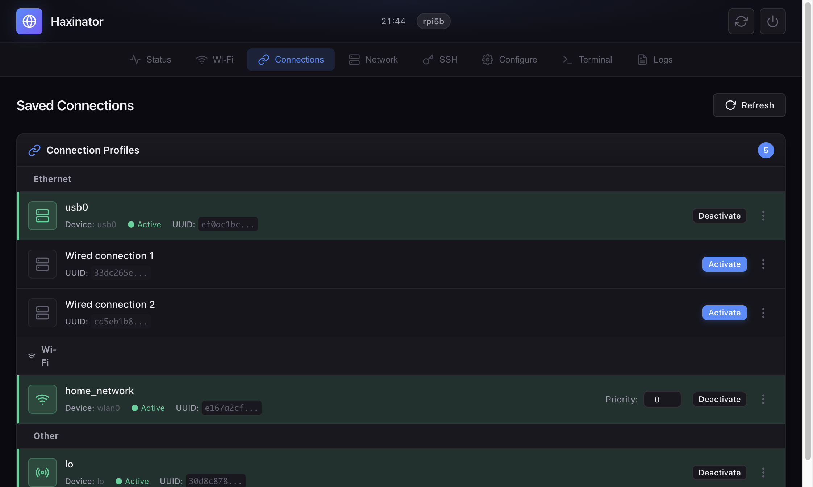
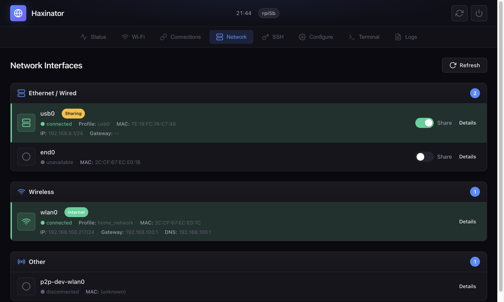
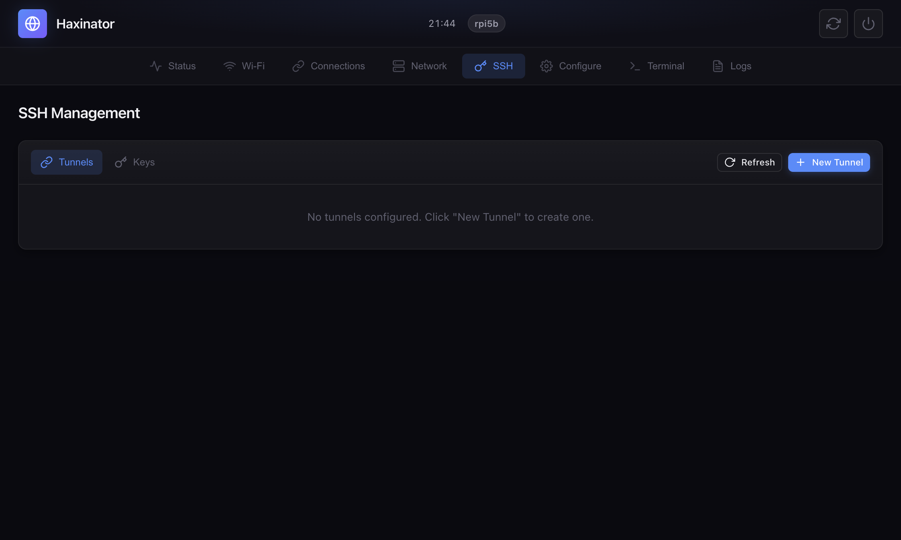
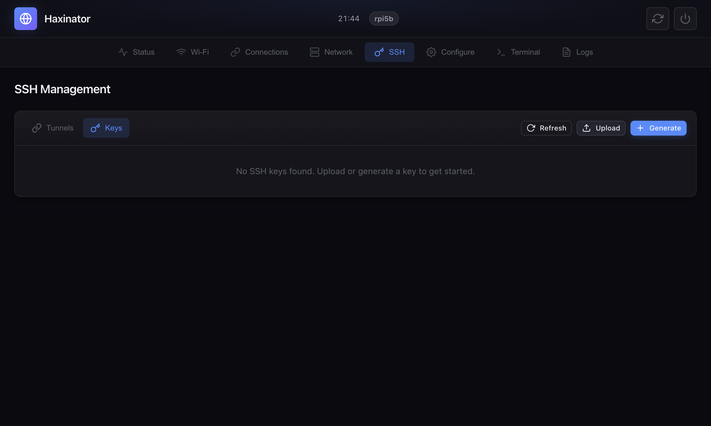
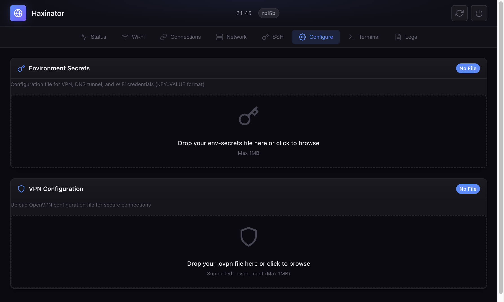
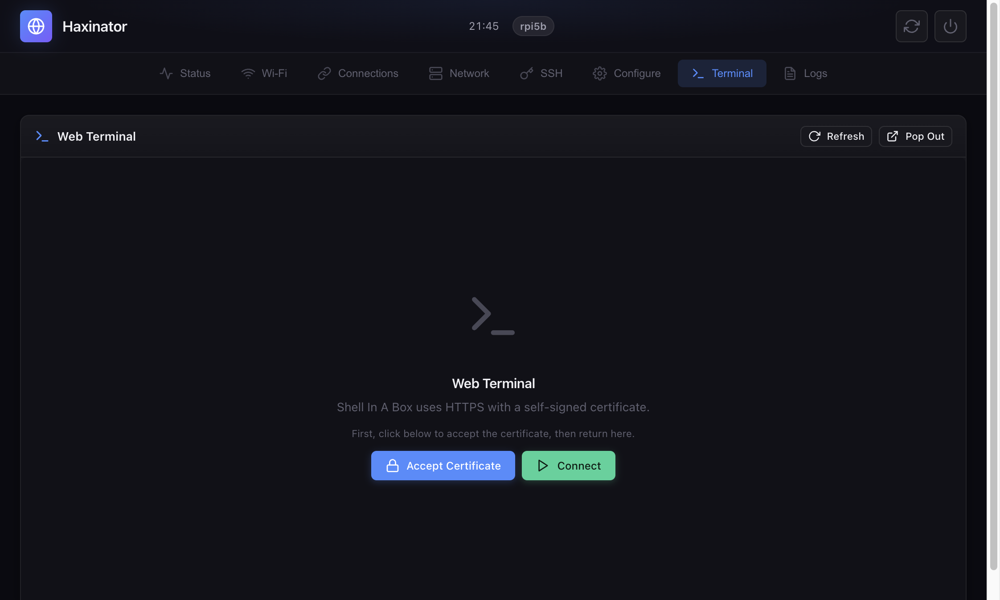
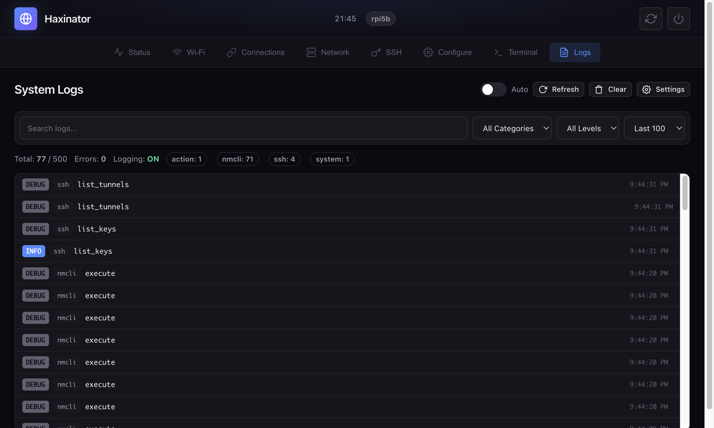

# Haxinator Web UI Guide

The Haxinator web interface provides a mobile-friendly way to manage your device's network connections, tunnels, and system settings.

---

## Accessing the Interface

**URL:** `http://192.168.8.1:8080`

The web UI uses HTTP Basic Authentication. On first boot, credentials are auto-generated and printed to the system log:

```bash
ssh root@192.168.8.1
journalctl -u nm-webui | grep password
```

You can also set custom credentials via environment variables or an auth file. See the [nm-webui README](../nm-webui/README.md) for details.

---

## Navigation

The interface is organized into 8 tabs, accessible from the top navigation bar:

| Tab | Purpose |
|-----|---------|
| **Status** | System overview and diagnostics |
| **Wi-Fi** | Connect to wireless networks |
| **Connections** | Manage saved network profiles |
| **Network** | View interfaces and sharing |
| **SSH** | Manage SSH keys and tunnels |
| **Configure** | Upload configuration files |
| **Terminal** | Web-based terminal access |
| **Logs** | View system activity logs |

The header also includes:
- Current time and hostname
- **Reboot** button (orange)
- **Shutdown** button (red)

---

## Status Tab


The Status tab provides an overview of your Haxinator's health and connectivity.

### System Info

Four cards showing real-time system metrics:
- **Disk (/)** - Used/total storage on the root partition
- **Memory** - Used/total RAM
- **Uptime** - Time since last boot
- **Load (1/5/15m)** - System load averages

### Diagnostics

Quick network tests to verify connectivity:

| Button | Function |
|--------|----------|
| **Check External IP** | Fetches your public IP address (useful for verifying tunnel is active) |
| **Run Lookup** | Performs DNS lookup for google.com |
| **Run Ping** | Pings 8.8.8.8 and shows packet loss/latency |

### Network Devices

Lists all network interfaces with their:
- Device name (e.g., `wlan0`, `usb0`)
- Type (ethernet, wifi)
- Connection state
- IP address and gateway (if connected)

---

## Wi-Fi Tab


Manage wireless network connections.

### Toolbar

- **Interface selector** - Choose which Wi-Fi adapter to use (usually `wlan0`)
- **Scan** - Refresh the list of available networks
- **Hidden Network** - Connect to a network that doesn't broadcast its SSID
- **Hotspot** - Create a Wi-Fi access point

### Available Networks

Shows all detected Wi-Fi networks with:
- Network name (SSID)
- Signal strength (percentage and bars)
- Security type (WPA2, WPA3, Open)
- Channel and band (2.4 GHz / 5 GHz)

**Actions:**
- Click **Connect** to join a network (you'll be prompted for the password)
- Click **Disconnect** on the active network to leave it
- Use the **...** menu to view details or forget a saved network

### Creating a Hotspot

Click **Hotspot** to create an access point:
1. Enter a name (SSID) for your hotspot
2. Set a password (minimum 8 characters)
3. Choose band (2.4 GHz or 5 GHz) and channel
4. Click **Create Hotspot**

---

## Connections Tab



Manage all saved NetworkManager connection profiles.

### Connection Profiles

Connections are grouped by type:
- **Ethernet** - Wired connections (including USB)
- **Wi-Fi** - Saved wireless networks
- **VPN** - OpenVPN and tunnel connections
- **Other** - Bridge, loopback, etc.

Each connection shows:
- Name and device
- Active status (green indicator)
- UUID (truncated)

### Actions

| Button | Function |
|--------|----------|
| **Activate** | Connect using this profile |
| **Deactivate** | Disconnect this profile |
| **Priority** (Wi-Fi only) | Set auto-connect priority (higher = preferred) |
| **...** menu | View details or delete |

### Wi-Fi Priority

For Wi-Fi connections, you can set a priority number. When multiple known networks are available, Haxinator will automatically connect to the one with the highest priority.

---

## Network Tab



View and manage network interfaces.

### Interface Groups

- **Ethernet / Wired** - USB gadget interface, physical ethernet
- **Wireless** - Wi-Fi adapters
- **Other** - P2P, bridge interfaces

### Interface Details

Each interface shows:
- Device name
- Connection state (connected/unavailable/disconnected)
- Profile name
- MAC address
- IP address, gateway, and DNS (if connected)

### Internet Sharing

The **Share** toggle allows you to share your internet connection through an interface.

For example, if `wlan0` is connected to the internet:
- Enable sharing on `usb0` to let your computer access the internet through the Pi
- The shared interface will provide DHCP to connected devices

The interface providing internet is labeled with a green **Internet** badge.

---

## SSH Tab

Manage SSH keys and tunnels for secure remote access.

### Tunnels Sub-Tab



Create and manage SSH tunnels.

**Tunnel Types:**

| Type | Flag | Description |
|------|------|-------------|
| **Local** | `-L` | Forward a local port to a remote destination |
| **Remote** | `-R` | Forward a remote port back to local |
| **Dynamic** | `-D` | Create a SOCKS proxy |

**Creating a Tunnel:**

1. Click **New Tunnel**
2. Enter the remote host and SSH port
3. Enter username and select authentication (key or password)
4. Choose tunnel type and configure ports
5. Click **Create**

Tunnels can be started/stopped individually and will show their status (running/stopped).

### Keys Sub-Tab



Manage SSH key pairs for authentication.

**Actions:**

| Button | Function |
|--------|----------|
| **Refresh** | Reload the key list |
| **Upload** | Upload an existing private key |
| **Generate** | Create a new key pair |

**Generating a Key:**

1. Click **Generate**
2. Enter a name for the key
3. Choose key type (Ed25519 recommended, or RSA/ECDSA)
4. Click **Generate**
5. Copy the public key to your remote servers

**Using Keys:**

- Click the **copy** icon to copy the public key to clipboard
- Click the **download** icon to download the public key file
- Use the **trash** icon to delete a key pair

---

## Configure Tab



Upload configuration files for tunnels and VPN.

### Environment Secrets

Upload your `env-secrets` file containing tunnel credentials:

```
IODINE_TOPDOMAIN=t.example.com
IODINE_NAMESERVER=203.0.113.50
IODINE_PASS=YourPassword
...
```

Drag and drop the file onto the upload zone, or click to browse.

### VPN Configuration

Upload OpenVPN configuration files (`.ovpn` or `.conf`):

1. Drag and drop your VPN config file
2. The system will import it into NetworkManager
3. Activate it from the **Connections** tab

### Network Configurations

After uploading files, Haxinator automatically detects available configurations:

- Shows which parameters were found
- Highlights any missing required parameters
- Displays file status (found/missing)

Select the configurations you want to enable and click **Apply Selected**.

---

## Terminal Tab



Access a web-based terminal using Shell In A Box.

### First-Time Setup

Shell In A Box uses HTTPS with a self-signed certificate:

1. Click **Accept Certificate** to open the terminal service in a new tab
2. Accept the browser's security warning
3. Return to the Haxinator UI
4. Click **Connect** to load the terminal

### Using the Terminal

- The terminal provides full shell access as root
- Use **Refresh** to reload the terminal
- Use **Pop Out** to open in a separate window

> **Tip:** The terminal runs on port 4200 with HTTPS. You can also access it directly at `https://192.168.8.1:4200`

---

## Logs Tab



View and search system activity logs.

### Toolbar

| Control | Function |
|---------|----------|
| **Auto** toggle | Enable automatic refresh (every 2 seconds) |
| **Refresh** | Manually reload logs |
| **Clear** | Delete all log entries |
| **Settings** | Configure logging options |

### Filters

- **Search** - Filter logs by text content
- **Category** - Filter by source (nmcli, system, action, api, ssh)
- **Level** - Filter by severity (DEBUG, INFO, WARN, ERROR)
- **Limit** - Show last 50/100/200/500 entries

### Log Entries

Each log entry shows:
- **Level** badge (color-coded)
- **Category** - What generated the log
- **Action** - What operation was performed
- **Duration** - How long it took (if applicable)
- **Status** - Success or failure indicator
- **Time** - When it occurred

Click on an entry to expand it and see additional details like command output or error messages.

### Stats Bar

Shows aggregate information:
- Total entries / maximum capacity
- Error count
- Logging enabled/disabled
- Entries per category

### Settings

Click **Settings** to configure:
- Enable/disable logging
- Log command strings (for debugging)
- Log command output
- Maximum entries to keep
- Maximum output length per entry
- Minimum log level to capture

---

## Tips & Tricks

### Mobile Use

The UI is fully responsive and works well on phones and tablets. Use it to configure your Haxinator while away from a computer.

### Keyboard Shortcuts

In the Terminal tab, standard terminal shortcuts work:
- `Ctrl+C` - Cancel command
- `Ctrl+D` - Logout
- `Ctrl+L` - Clear screen

### Quick Diagnostics

If you're troubleshooting connectivity:
1. Go to **Status** tab
2. Click all three diagnostic buttons
3. Check **External IP** shows your tunnel server's IP (not your local IP)
4. If DNS lookup fails, your tunnel may not be routing DNS properly

### Connection Priority

Set higher priority numbers for preferred networks. When you're in range of multiple saved networks, Haxinator will connect to the highest priority one automatically.
